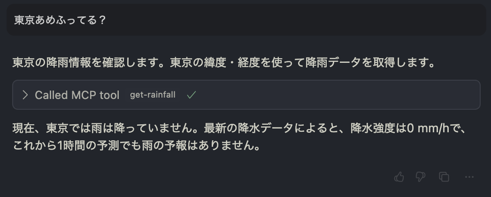

# 降水量 MCP サーバー

Yahoo! の天気情報 API を使用した降水量データを提供する Model Context Protocol (MCP) サーバーです。

## 機能

このサーバーは以下の 2 つのツールを提供します：

1. **get-rainfall**: 日本の指定座標における現在と予測の降水強度データを取得
2. **get-rainfall-past**: 過去 1〜2 時間の降水強度履歴を取得

## 前提条件

- Node.js 18 以上
- Yahoo!デベロッパーネットワークの API キー
  - [Yahoo!デベロッパーネットワーク](https://developer.yahoo.co.jp/)で取得できます

## インストール

```bash
git clone git@github.com:musasabibyun/mcp-rainfall.git
cd mcp-rainfall
npm install
```

## ビルド

```bash
npm run build
```

## 使い方

## mcp.json での設定

```json
{
  "mcp-rainfall": {
    "command": "node",
    "args": [
      "/path/to/mcp-rainfall/build/index.js",
      "--yahoo-app-id=YOUR_API_KEY"
    ]
  }
}
```

### 使用例


